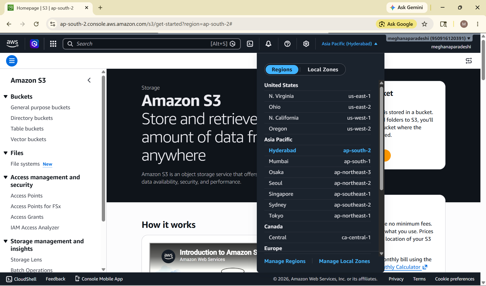
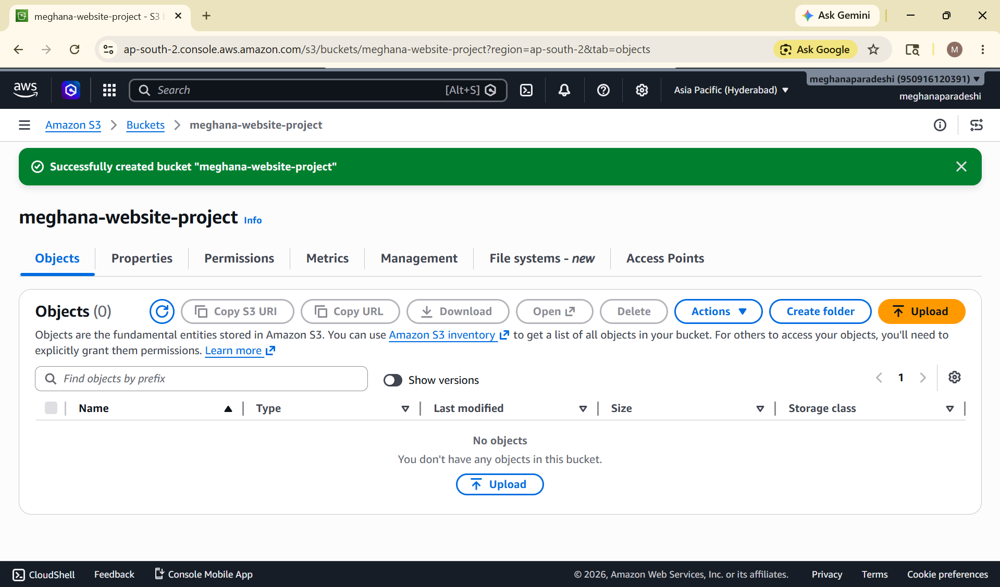
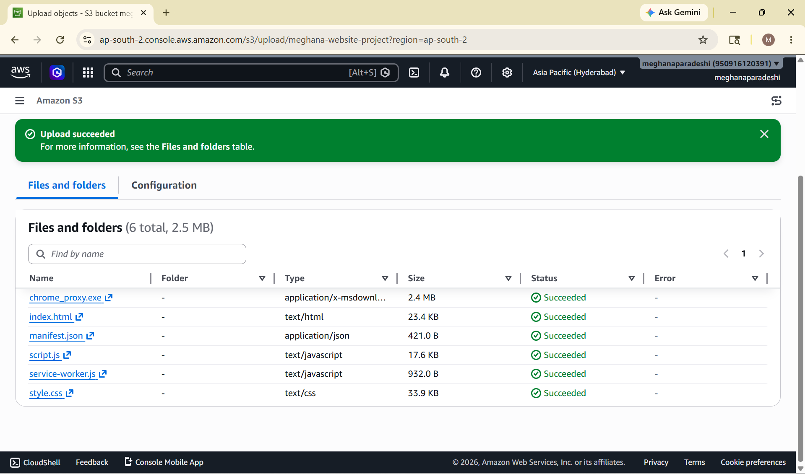
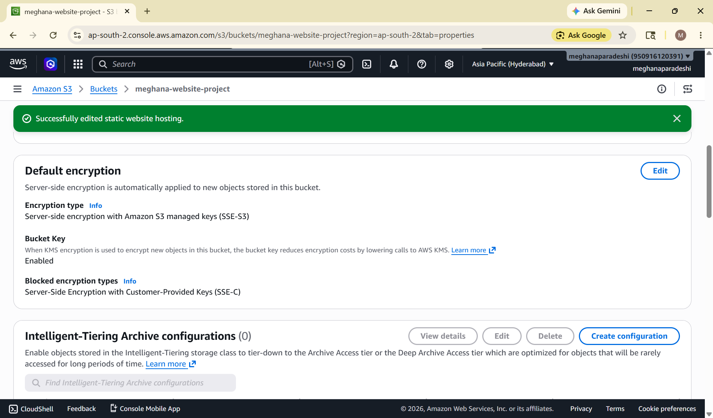
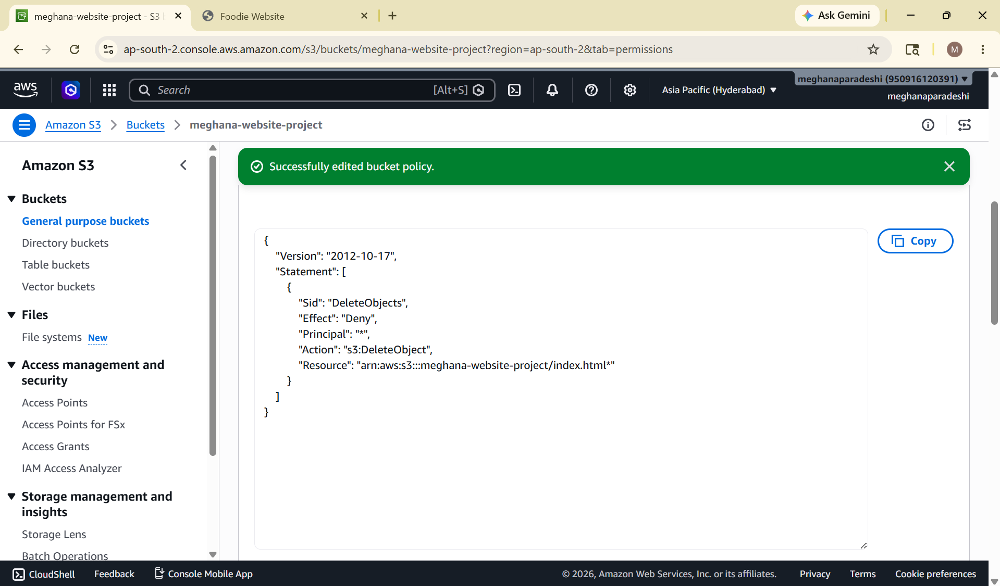
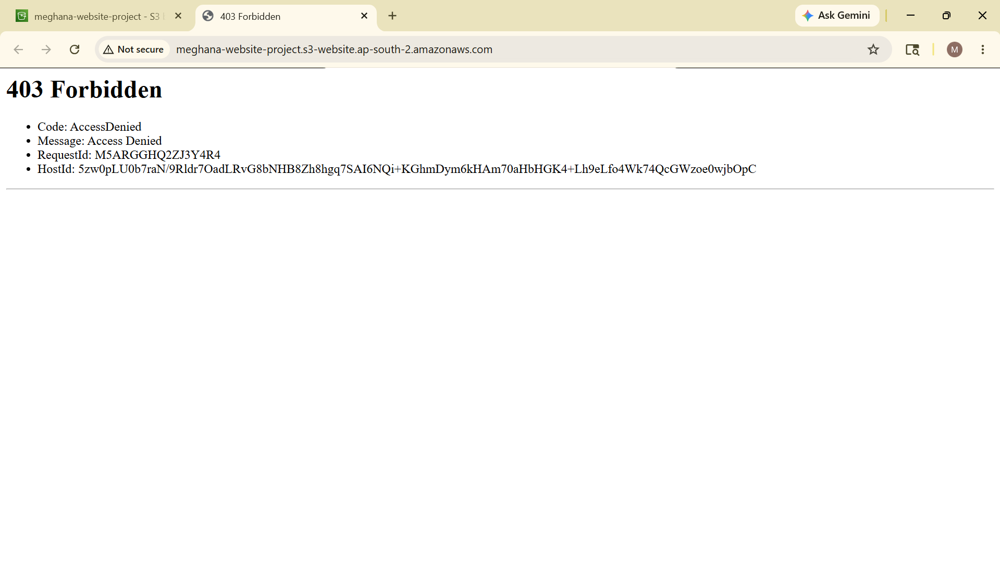
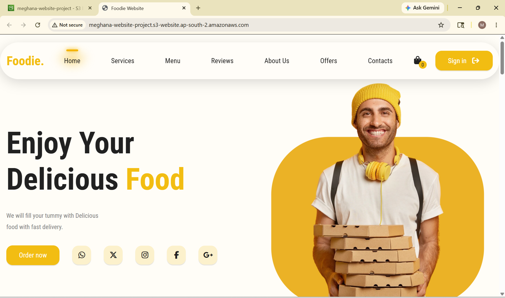
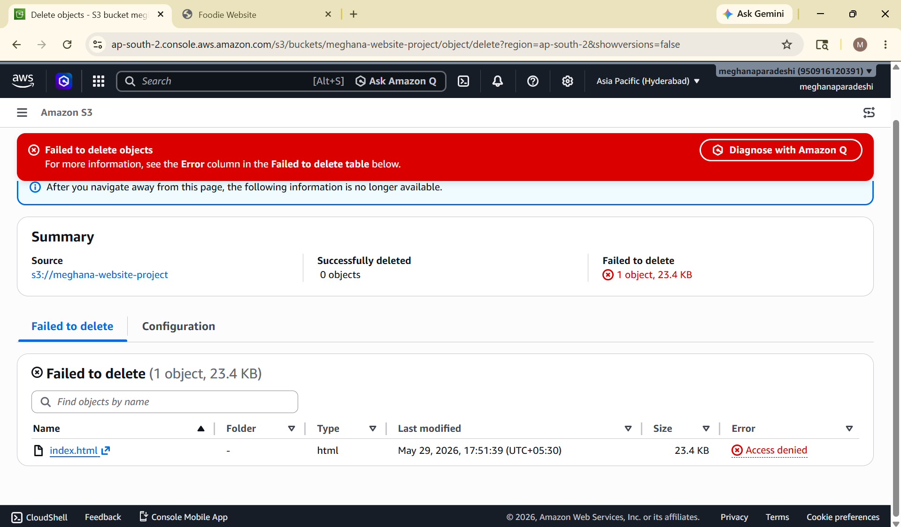

# AWS S3 Static Website Hosting

## Live Demo

Website was successfully hosted using Amazon S3 Static Website Hosting.

Endpoint Used:
http://meghana-website-project.s3-website.ap-south-2.amazonaws.com

---

## Project Status

✅ Completed Successfully

---

## Project Overview

This project demonstrates how to deploy and host a static website using Amazon S3. The website files were uploaded to an S3 bucket, Static Website Hosting was enabled, and bucket policies were configured to allow public access.

The primary objective of this project was to understand AWS S3 hosting, bucket permissions, public access configuration, and cloud deployment fundamentals.

---

## Features

* Static website hosting using Amazon S3
* Public website accessibility
* Bucket policy configuration
* Static Website Hosting configuration
* Cloud-based deployment
* Resource cleanup after deployment

---

## Tech Stack

### Frontend

* HTML5
* CSS3
* JavaScript

### Cloud Services

* Amazon S3
* AWS IAM
* AWS Management Console

### Version Control

* Git
* GitHub

---

## Project Architecture

```text
User Browser
      │
      ▼
Amazon S3 Bucket
      │
      ▼
Static Website Hosting
      │
      ▼
Foodie Website
(HTML, CSS, JavaScript, Images)
```

---

## Folder Structure

```text
AWS-S3-Static-Website-Hosting/
│
├── cloudss/
│   ├── region-selected.png
│   ├── s3-bucket-created.png
│   ├── website-files-uploaded.png
│   ├── static-website-hosting-enabled.png
│   ├── bucket-policy-configured.png
│   ├── 403-access-denied.png
│   ├── website-hosted-successfully.png
│   └── failed-to-delete.png
│
├── icons/
│   └── website icons
│
├── images/
│   └── website images
│
├── index.html
├── style.css
├── script.js
├── manifest.json
├── service-worker.js
│
├── README.md
└── LICENSE
```


---

## Deployment Steps

1. Created an Amazon S3 Bucket.
2. Uploaded website files.
3. Enabled Static Website Hosting.
4. Configured Index Document.
5. Updated Public Access Settings.
6. Added Bucket Policy.
7. Tested Website Endpoint.
8. Fixed Access Denied (403) Issues.
9. Successfully Hosted Website.
10. Deleted AWS Resources after completion.

---
## Screenshots

### 1. Region Selected


### 2. S3 Bucket Created


### 3. Website Files Uploaded


### 4. Static Website Hosting Enabled


### 5. Bucket Policy Configured


### 6. 403 Access Denied Error


### 7. Website Hosted Successfully


### 8. Resource Cleanup


---

## How to Run Locally

1. Clone the repository

```bash
git clone https://github.com/meghana1125-ui/AWS-S3-Static-Website-Hosting.git
```

2. Open the project folder

```bash
cd AWS-S3-Static-Website-Hosting
```

3. Open index.html in your browser

---

## Challenges Faced

### Access Denied (403 Error)

Issue:

* Website was not accessible after deployment.

Root Cause:

* Files were uploaded inside a folder.
* Bucket permissions were not configured correctly.

Solution:

* Moved website files to the correct location.
* Configured bucket policy.
* Enabled public access.
* Verified index.html configuration.

---

## Note

All AWS resources used in this project were deleted after successful testing and deployment to avoid unnecessary charges and follow cloud cost-management best practices.

---


## Learning Outcomes

* Amazon S3 Fundamentals
* Static Website Hosting
* Bucket Policies
* Public Access Configuration
* AWS Deployment Process
* Git & GitHub Workflow
* Cloud Resource Management

---

## Future Enhancements

* Deploy using CloudFront
* Configure Route 53 custom domain
* Enable HTTPS using ACM
* Implement CI/CD using GitHub Actions
* Add monitoring and logging

---

## Author

Meghana Paradeshi

Aspiring Cloud Engineer

GitHub: https://github.com/meghana1125-ui

---

## Support

If you found this project useful, consider giving it a ⭐ on GitHub.
